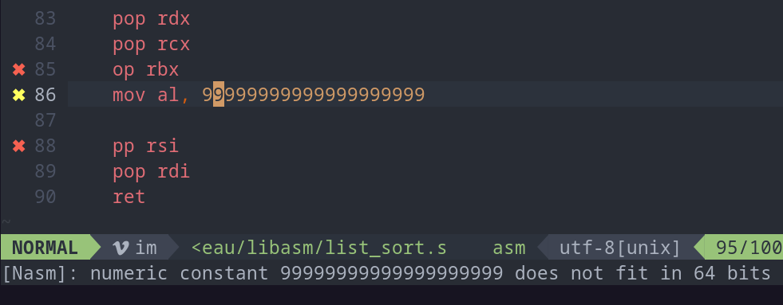

A nasm-linter plugin for vim9



## Dependency

- nasm
- vim9

# How Install

### for any vim9
```
# download the nasminette.vim
mkdir -p $HOME/.vim/plugin
cp nasminette.vim $HOME/.vim/plugin/
```

### SupraVim

`suprapack install plugin-nasm-linter`
